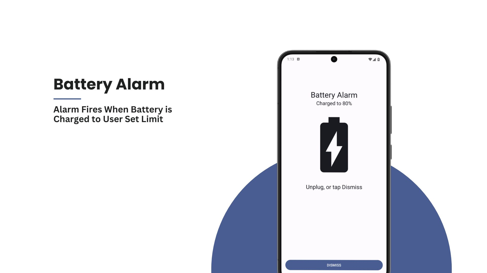
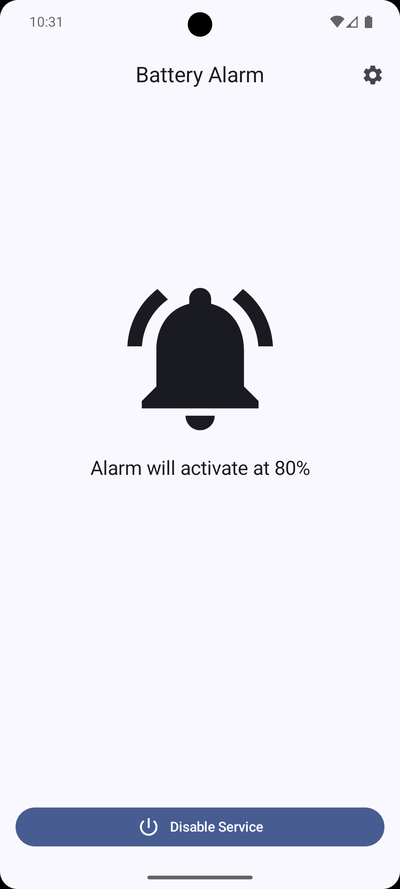
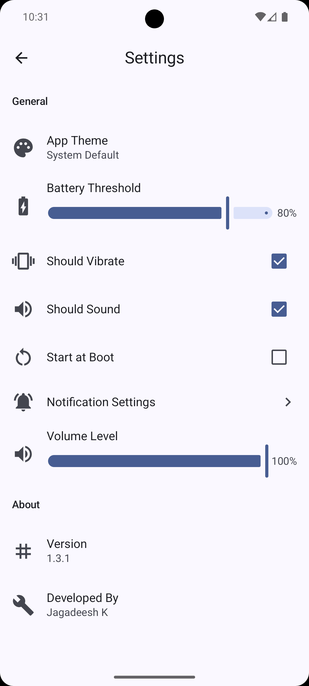
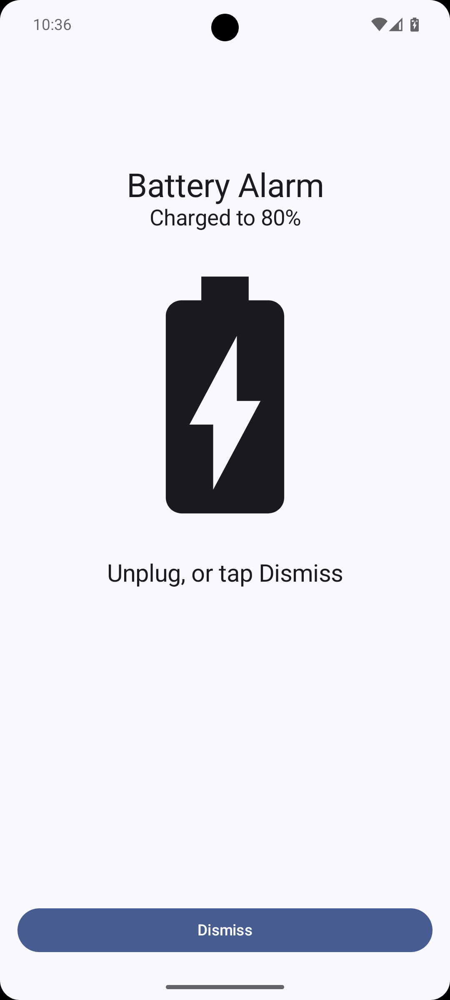

# Battery Alarm (Kotlin) 🔋⏰


<br />

Android Application that offers users a customizable alarm feature for monitoring their device's charging status.
Users can set specific charging limits. The application ensures a user-friendly experience by allowing users to easily stop
the alarm by unplugging their device.

## Features 📲

- Set Custom Limit
- Enable/Disable Vibration, Sound
- Set Alarm Volume Level

## Screenshots 📷





## Build Instructions 🛠️

1. **Prerequisites:**
   - Java Development Kit (JDK) 17
   - Android SDK

2. **Clone the repository:**
   ```bash
   git clone https://github.com/jagadeesh-k-2802/battery-alarm-android.git
   cd battery-alarm-android
   ```

3. **Build the project:**
   ```bash
   chmod +x gradlew
   ./gradlew assembleDebug
   ```

The APK will be generated at `app/build/outputs/apk/debug/app-debug.apk`.

## Links 🔗

<a href="https://github.com/jagadeesh-k-2802/battery-alarm-android/releases/latest" target="_blank">
    
</a>
